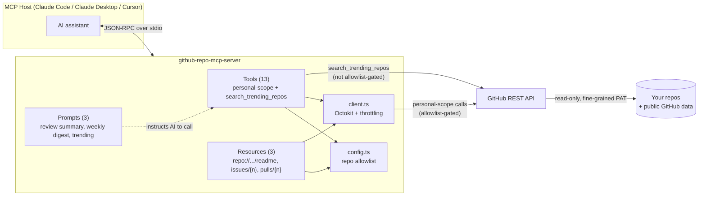

# github-repo-mcp-server

An MCP (Model Context Protocol) server that lets an AI assistant query GitHub
on your behalf — your own repos, issues, PRs, and CI status, plus discovery
of trending repos by topic across public GitHub.

See [SPEC.md](./SPEC.md) for the full design and development plan.

## Why we built this

This started as a learning project to understand MCP by actually building
one, not just reading about it - so the goal was a server that (a) does
something genuinely useful day to day, and (b) touches all three MCP
primitives (tools, resources, prompts) instead of just tools, which is
where most "hello world" MCP examples stop.

GitHub was the right domain for that: it has a mature, well-documented,
official REST API (no scraping, no unofficial endpoints, no partner
approval needed to get started), it's something we already use constantly,
and it naturally splits into two different trust boundaries worth
modeling - *your own repos* (should be tightly scoped) vs. *public GitHub
data at large* (fine to query more freely). That split became the
project's actual design backbone: see [Architecture](#architecture) below.

The specific tool set also traces back to a real question asked earlier in
this project: *"what's trending in machine learning right now?"* Answering
that honestly - GitHub's real Trending page has no API, and "trending in
the US" isn't answerable at all since repos have no geography field - is
what shaped `search_trending_repos` into an honest proxy instead of a
fake exact match. That mix of "build the useful thing" and "be upfront
about what's actually possible" carried through the rest of the tools too.

## Architecture



Two trust boundaries drive the whole design:

- **Personal scope** — every tool that touches a specific repo
  (`get_repo`, `list_issues`, `get_file_contents`, etc.) is checked against
  `config.json`'s allowlist before it's allowed to run. A token scoped to
  your repos plus code that enforces the allowlist means the server
  physically cannot read a repo you didn't list, even if the AI asked it to.
- **Global discovery** — `search_trending_repos` is deliberately exempt
  from the allowlist, since it searches public GitHub data at large rather
  than a specific repo. Same GitHub API, different trust model, so it's
  routed differently in code, not just documented differently.

Prompts sit a layer above both: they don't call GitHub directly, they
return instructions telling the AI *which* tools to call and how to
summarize the results - the same primitive as a saved prompt template a
human would write, just server-hosted so every client that connects gets
it for free.

## Status

✅ All planned milestones complete.

- [x] M0 — Project scaffold: TypeScript + MCP SDK, minimal `ping` tool over stdio
- [x] M1 — GitHub client + config (Octokit auth, repo allowlist)
- [x] M2 — Tier 1 read-only personal-repo tools (12 tools)
- [x] M3 — `search_trending_repos` discovery tool
- [x] M4 — MCP resources (README, issue/PR content)
- [x] M5 — MCP prompts (reusable templates)
- [x] M6 — Tests, rate-limit hardening, docs

Tier 2 write tools (create issue, comment, etc.) were scoped out of v1
intentionally — see SPEC.md §11. This is a read-only server.

## Requirements

- Node.js 18+ (developed against Node 20; see `.nvmrc`)

## Configuration

1. Copy `.env.example` to `.env` and set `GITHUB_TOKEN` to a
   [fine-grained personal access token](https://github.com/settings/tokens?type=beta)
   with read-only `Contents`, `Issues`, `Pull requests`, and `Actions`
   permissions, scoped to the repos you want this server to access.
2. List those repos (as `"owner/repo"` strings) in `config.json` — this is
   the allowlist personal-scope tools are restricted to. `search_trending_repos`
   is exempt, since it queries public GitHub data rather than a specific repo.
3. `get_notifications` additionally needs the token's **Notifications**
   *account* permission (separate section from repository permissions on
   the token creation page) — every other tool works without it.

## Tools

**Personal scope** (allowlist-gated): `get_repo`, `list_repos`, `list_branches`,
`list_commits`, `get_file_contents`, `list_issues`, `get_issue`,
`list_pull_requests`, `get_pull_request`, `search_code`, `get_workflow_runs`,
`get_notifications`.

**Global discovery** (not allowlist-gated, searches public GitHub data):
`search_trending_repos` — finds trending repos for a topic, ranked by star
velocity among recently-created repos. A documented proxy for
github.com/trending, which has no official API.

## Resources

| URI template | Content |
|---|---|
| `repo://{owner}/{repo}/readme` | The repo's README, as markdown |
| `repo://{owner}/{repo}/issues/{number}` | Issue title, body, and comments |
| `repo://{owner}/{repo}/pulls/{number}` | PR title, description, diff stats |

## Prompts

| Name | What it does |
|---|---|
| `summarize_prs_for_review` | Finds open PRs and summarizes which need attention |
| `weekly_repo_digest` | Commits, issues, PRs, and CI status from the last week |
| `whats_trending` | Trending public repos for a GitHub topic |

## Getting started

```bash
npm install
npm run dev     # run the server directly via tsx
npm run build   # compile to dist/
npm start       # run the compiled server
```

The server communicates over stdio, following the MCP protocol — it's meant
to be launched by an MCP-compatible host (e.g. Claude Code, Claude Desktop,
Cursor), not run standalone in a terminal.

## Manual testing with MCP Inspector

[MCP Inspector](https://github.com/modelcontextprotocol/inspector) is the
official visual testing tool for MCP servers — it gives you a web UI to
browse every tool/resource/prompt and call them interactively, instead of
hand-typing JSON-RPC.

```bash
npm run build   # inspector launches the compiled server, so build first
npx @modelcontextprotocol/inspector@latest node --env-file=.env dist/index.js
```

This prints a local URL with an auth token pre-filled, e.g.:

```
MCP Inspector Web is up and running at:
   http://localhost:6274?MCP_INSPECTOR_API_TOKEN=<token>
```

Open that URL (it also tries to open your browser automatically). From
there you can call any tool with real arguments - e.g. `get_repo` with
`owner: <your-username>`, `repo: <a-repo-in-your-allowlist>`, or
`search_trending_repos` with `topic: machine-learning` - and see the live
result. The token in the URL authenticates your session; treat it like a
credential and don't share the link.

Note: Inspector v2 lists Node 22+ as its required engine. It still runs
fine on Node 20 (just an `EBADENGINE` warning, not a hard failure) - if you
hit a real compatibility issue, `npm i -g n && n 22` (or your Node version
manager's equivalent) resolves it.

## Testing

```bash
npm test        # typecheck (src + test) then run the full vitest suite
npm run typecheck
```

The suite (32 tests) runs through the real MCP protocol layer — an
`McpServer` and `Client` connected over an in-memory transport — with
`@octokit/rest` mocked, so it exercises actual schema validation and request
routing without making live API calls. Every tool, resource, and prompt was
also manually verified against a real repo during development; see individual
commit messages for what was and wasn't exercised against real data.

## What we learned

**About MCP as a protocol:**
- It's JSON-RPC 2.0 underneath, nothing exotic - once you've seen the
  `initialize` handshake and one `tools/call` round trip, you've seen the
  shape of the whole protocol. Everything else is more of the same three
  message types (tools, resources, prompts) repeated.
- Tools, resources, and prompts are genuinely different primitives, not
  three names for the same thing. Tools are actions the AI decides to
  invoke; resources are addressable content the AI (or a human) can read
  directly without a tool call; prompts are server-authored instructions
  that tell the AI *which* tools to call and how - a reusable playbook,
  not a data fetch. Building all three (not just tools, which is where
  most examples stop) is what made the distinction click.
- A server is trust-boundary-agnostic by default - it'll do whatever the
  code allows. The allowlist pattern here (`config.ts` gating every
  personal-scope tool) exists because MCP itself provides no scoping; the
  server author has to build it.

**About testing against real data instead of assuming code is correct:**
Every tool, resource, and prompt was smoke-tested against a live repo
during development, which surfaced real issues a "does it compile" check
would have missed entirely:

- **GitHub's code search doesn't index unstarred forks.** `search_code`
  returned 0 results with `incomplete_results: true` against a fresh fork -
  confirmed via a raw `curl` call that this is GitHub's own indexing
  limitation, not a bug (forks are only code-search-indexed once they have
  more stars than their parent repo).
- **`get_notifications` needs a separate token permission.** It uses a
  GitHub *account*-level permission (Notifications), not a repository
  permission like every other tool - discovered via a live 403, now
  surfaced as a specific error message instead of the generic one.
- **Composed Octokit plugin types aren't portable.** Wrapping the client
  with `@octokit/plugin-throttling` broke `.d.ts` emission (TS2883). Fixed
  by dropping `declaration: true` from `tsconfig.json`, since this is a
  runnable server, not a library other packages import.
- **A separate test tsconfig was needed.** The main `tsconfig.json`
  excludes `test/` from compilation, so `tsc --noEmit` silently never
  type-checked the test files - vitest's esbuild transform strips types
  without checking them. `tsconfig.test.json` plus wiring `npm test` to
  typecheck first caught real unsafe-property-access bugs in the tests
  that were otherwise invisible.

## License

MIT
